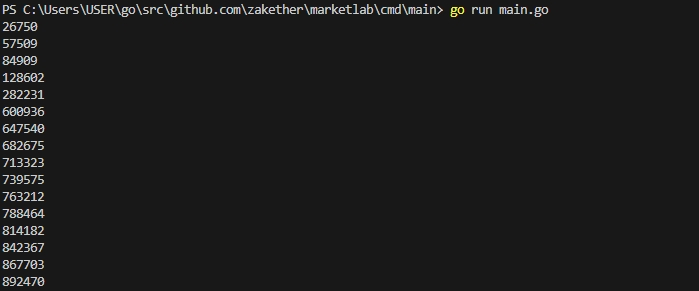

# Пайплайн Обработки Данных

Задача - реализовать пайплайн обработки данных

Задача состоит из: 

## 1. Ввод данных
- **Описание**: Пайплайн получает пакеты данных через регулярные промежутки времени
- **Пакет Данных**: Пакет данных - собой слайс из 10 рандомных целых чисел
- **Интервал**: Новый пакет подается каждые `N` миллисекунд

## 2. Обработка Пакетов
- **Описание**: Обработка данных из каждого пакета для нахождения 3-х наибольших чисел
- **Входные Данные**: Срез из 10 целых чисел.
- **Выходные Данные**: Срез из 3-х наибольших чисел
- **Количество Воркеров**: Обработка выполняется `M` воркерами 

## 3. Аккумулятор
- **Описание**: Суммирование чисел из обработанных пакетов
- **Выходные Данные**: Переменная `int`, содержащая сумму чисел

## 4. Публикатор
- **Описание**: Вывод текущего значения аккумулятора в консоль
- **Интервал Публикации**: Публикация значения производится каждые `K` секунд 

## Пример Работы
- **Входные Данные**: `{1, 9, 6, 4, 4, 5, 7, 8, 0, 1}`
- **Обработка**: `{9, 7, 8}`
- **Аккумулятор**: `9 + 7 + 8 = 24`
- **Публикация**: `24`

## Результат

!